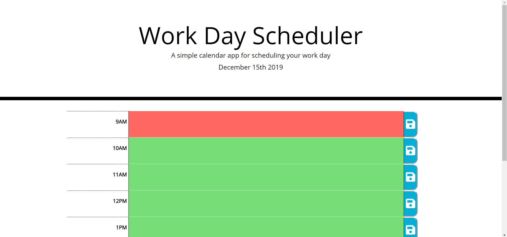
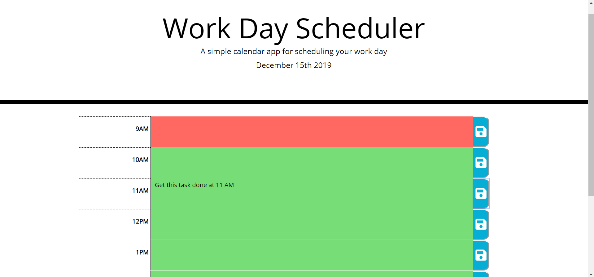

# Work Day Planner

## Overview

The purpose of this application is to provide a method to plan out tasks hour by hour during the standard workday.

Hosted Application:
https://dandukes.github.io/homework_5/

### Gallery

Base Application:

Text Saved:

### Problem

Most task tracking applications or reminder lists don't provide an easy way to tell at a visual glance how far along the day has progressed, letting users fall behind without them even noticing.

### Solution

My application will provide an easy and prominant visual reminded of where exactly in the day the user is, leading to clarity on what tasks should have already been done, what should be being completed, and what is coming up.

## Tech and Features Used

* Bootstrap
* Javascript / JQuery
* Moment.js library

## How to use

When the appliacation is loaded it will pull and display the current time.  Based on the time, the rows will be color coded.
Grey indicated that the time has already passed, Green indicated that the time is upcoming, and Red is the current hour block.

Users should input the tasks they want to work on(as text) in the row corresponding to the hour in which they want the task to be done.  Simply click the save button to the right of the corresponding row to "lock in" the task.  It will persist in that slot until it is cleared by deleting the text in the row and saving an empty area.

## Technical Overview

1. The loop in the script.js loops through an array of objects that defines the time range.
2. That loop has iterates over the array builds a row for each object in the array and appends them to the DOM.
3. The loop will also check if a value for the corresponding row exists in localstorage, and if so, will grab it and set it in the DOM.
4. The current date and current hour are gathered with moment.js.  The date is displayed on the page, the hour is used to set row classes.
5. There is a second loop which goes through the rows and evaluates their time value in relation to the current hour and sets the css class accordingly.
6. There is an event listener on each button which will fire the savetext() function.
7. The savetext() function will grab whatever text is in the button's corresponding textarea and save it in local storage

